# Financial Planning Hub

## Overview

The Financial Planning Hub is an internal platform designed for the CFO and
financial planning teams of a banking institution. It serves as a central access
point for financial data visualizations, analytics tools, and interdepartmental
data collection workflows. Built as a multi-page application (MPA), the hub
maintains a unified design language while allowing each functional module to
operate independently yet remain integrated within the ecosystem.

## Core Features

- **Centralized Dashboard Access**: Embedded visualizations from Tableau/Power
  BI
- **Data Collection Workflows**: Structured forms and file uploads for
  departmental reporting
- **Data Validation & Processing**: Automated validation of financial inputs
- **Analytics Integration**: Direct connection to Databricks for advanced
  analytics
- **Role-based Access**: Tailored views based on department and responsibility
  level

## Architecture Diagrams

### System Context

```mermaid
flowchart LR
  subgraph Users
    CFO["👑 CFO & Leadership"]
    FP["👤 Financial Planning<br/>Team"]
    DE["👤 Departmental<br/>Employees"]
  end

  subgraph "FinHub Platform"
    WebApp[🌐 Financial Planning Hub]
    Auth["🔐 Authentication"]
  end

  subgraph "External Systems"
    BI["📊 Business Intelligence<br/>(Tableau/Power BI)"]
    DTB["🔍 Databricks"]
  end

  CFO --> WebApp
  FP --> WebApp
  DE --> WebApp
  WebApp --> Auth
  Auth --> BI
  Auth --> DTB
  DTB --> WebApp
    
  classDef primary fill:#4285F4,stroke:#333,stroke-width:1px,color:white
  classDef secondary fill:#34A853,stroke:#333,stroke-width:1px,color:white
  classDef tertiary fill:#FBBC05,stroke:#333,stroke-width:1px,color:white
    
  class WebApp primary
  class CFO,FP,DE secondary
  class Auth,BI,DTB tertiary
```

### Container Architecture

```mermaid
flowchart TD
  subgraph Users
    CFO["👑 CFO & Leadership"]
    FP["👤 Financial Planning<br/>Team"]
    DE["👤 Departmental<br/>Employees"]
  end
    
  subgraph "Financial Planning Hub"
    WebApp["🖥️ Astro Web App"] --> Auth["🔐 Authentication"]
    API["⚙️ Backend API"]
    DB[(🗃️ DuckDB)]
    Pipeline["🔄 Data Pipeline"]
  end
    
    CFO --> WebApp
    FP --> WebApp
    DE --> WebApp
    Auth --> API
    API -->  DB
    API -->  Pipeline
    Auth --> BI["📊 Business Intelligence<br/>(Tableau/Power BI)"]
    Pipeline --> DTB["🔍 Databricks"]
    
    classDef primary fill:#4285F4,stroke:#333,stroke-width:1px,color:white
    classDef secondary fill:#34A853,stroke:#333,stroke-width:1px,color:white
    classDef tertiary fill:#FBBC05,stroke:#333,stroke-width:1px,color:white
    
    class WebApp,API,Auth,Pipeline primary
    class CFO,FP,DE secondary
    class BI,DB,DTB tertiary
```

### Data Flow Diagram

```mermaid
sequenceDiagram
    actor User as 👤 User
    participant Web as 🖥️ Hub Web App
    participant Auth as 🔐 Authentication
    participant API as ⚙️ Backend API
    participant DB as 🗃️ DuckDB
    participant BI as 📊 Tableau/Power BI
    participant Pipeline as 🔄 Data Pipeline
    participant DTB as 🔍 Databricks

    User->>Web: Access Hub
    Web->>Auth: Authenticate
    Note over Auth: SSO/OAuth Integration
    Auth-->>Web: Auth Token
    Web-->>User: User Authenticated

    alt View Dashboards
        User->>Web: Request Dashboard
        Web->>BI: Embed Dashboard (SSO)
        BI-->>Web: Dashboard View
        Web-->>User: Render Dashboard
    else Upload/Validate Data
        User->>Web: Submit Data
        Web->>API: Send Data
        API->>DB: Validate & Store
        Note over DB: Temporary Raw Data
        DB-->>API: Confirmation
        API-->>Web: Success/Error
        Web-->>User: Feedback
    end
    loop Every Day
        API->>DTB: Trigger Sync & Replicate Data
        DTB-->>API: Sync Complete
    end
    opt Manual Data Sync
        User->>Web: Request Data Sync
        Web->>API: Trigger Sync
        API->>DTB: Sync Now
        DTB-->>API: Sync Complete
        API-->>Web: Sync Done
        Web-->>User: Notify Sync Complete
    end
```

## Technical Architecture

### Frontend

- **Framework**: Astro for page structure with React components for interactive
  elements
- **Integration**: Embedded dashboards via iFrames with SSO pass-through

### Backend

- **Framework**: Node.js with Hono for lightweight API endpoints
- **Data Layer**: DuckDB for both local development and production
  - Supports SQL interface similar to PostgreSQL
  - Seamless integration with Parquet files for Databricks connectivity
  - In-process and server modes for flexibility

### Data Architecture

- **Primary Database**: DuckDB for structured data storage and queries
- **Analytics**: Databricks integration for advanced data processing
- **Data Flow**: Automated pipeline for syncing between DuckDB and Databricks
- **File Format**: Parquet for efficient data transfer and storage

### Security

- **Authentication**: OAuth/SSO integration
- **Authorization**: Role-Based Access Control (RBAC)
- **Data Protection**: Input validation, sanitization, and audit logging
- **Compliance**: Financial data governance controls
